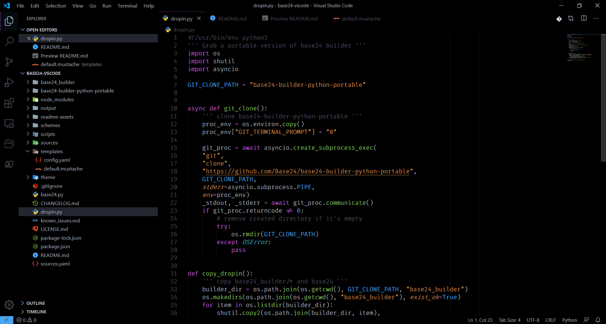

[](../../)
[](https://www.codacy.com/manual/Base24/base24-vscode)
[](../../issues)
[](/LICENSE.md)
[](../../commits/master)
[](../../commits/master)


<!-- omit in TOC -->
# base24-vscode


Base 24 themes for VSCode https://code.visualstudio.com/ based on the Dracula
theme https://github.com/dracula/visual-studio-code

- [Install with vscode](#install-with-vscode)
- [Install using Git](#install-using-git)
- [Activating theme](#activating-theme)
- [Screenshots](#screenshots)
	- [Atom One Dark](#atom-one-dark)
	- [Atom One Light](#atom-one-light)
	- [Atom One Black](#atom-one-black)
- [Download](#download)
	- [Clone](#clone)
		- [Using The Command Line](#using-the-command-line)
		- [Using GitHub Desktop](#using-github-desktop)
	- [Download Zip File](#download-zip-file)
- [Community Files](#community-files)
	- [Licence](#licence)
	- [Changelog](#changelog)
	- [Code of Conduct](#code-of-conduct)
	- [Contributing](#contributing)
	- [Security](#security)

## Install with vscode

1. Search and install
	```none
	fredhappyface.base24
	```
2. Load theme
	Open the command palette and type `Base24 Activate Theme` and select your
	preferred theme
3. Activate the theme (see [Activating theme](#activating-theme))


## Install using Git

Install the theme and keep up to date by cloning the repo:

1. Clone the project to vscode
	Windows
	```bash
	git clone https://github.com/Base24/base24-vscode.git $home/.vscode/extensions/theme-base24
	cd $home/.vscode/extensions/theme-base24
	```
	Linux
	```bash
	git clone https://github.com/Base24/base24-vscode.git ~/.vscode/extensions/theme-base24
	cd ~/.vscode/extensions/theme-base24
	```
2. Set up the project and build the themes
	```bash
	./dropin.py
	./base24 update
	./base24 build
	```

## Activating theme

Run Visual Studio Code. The `Base24` Theme will be available from
`File -> Preferences -> Color Theme` dropdown menu.

Or open the command palette with `ctrl+shift+p` and type
`Preferences: Color Theme` and select `Base24`

Alternatively, paste the following snippet into `settings.json`

```json
"workbench.colorTheme": "Base24"
```

## Screenshots

### Atom One Dark


### Atom One Light


### Atom One Black


## Download
### Clone
#### Using The Command Line
1. Press the Clone or download button in the top right
2. Copy the URL (link)
3. Open the command line and change directory to where you wish to
clone to
4. Type 'git clone' followed by URL in step 2
```bash
$ git clone https://github.com/Base24/base24-vscode
```

More information can be found at
<https://help.github.com/en/articles/cloning-a-repository>

#### Using GitHub Desktop
1. Press the Clone or download button in the top right
2. Click open in desktop
3. Choose the path for where you want and click Clone

More information can be found at
<https://help.github.com/en/desktop/contributing-to-projects/cloning-a-repository-from-github-to-github-desktop>

### Download Zip File

1. Download this GitHub repository
2. Extract the zip archive
3. Copy/ move to the desired location

## Community Files
### Licence
MIT License

components not listed below, modifications to components below: <br>
Copyright (c) 2020 Base24

extension.ts: <br>
Copyright (c) 2017 Sanders Lauture

templates/default.mustache, scripts/build.js, scripts/generate.js,
scripts/lint.js, known_issues.md: <br>
Copyright (c) 2016 Dracula Theme

(See the [LICENSE](/LICENSE.md) for more information.)

### Changelog
See the [Changelog](/CHANGELOG.md) for more information.

### Code of Conduct
In the interest of fostering an open and welcoming environment, we
as contributors and maintainers pledge to make participation in our
project and our community a harassment-free experience for everyone.
Please see the
[Code of Conduct](https://github.com/Base24/.github/blob/master/CODE_OF_CONDUCT.md) for more information.

### Contributing
Contributions are welcome, please see the [Contributing Guidelines](https://github.com/Base24/.github/blob/master/CONTRIBUTING.md) for more information.

### Security
Thank you for improving the security of the project, please see the [Security Policy](https://github.com/Base24/.github/blob/master/SECURITY.md) for more information.
